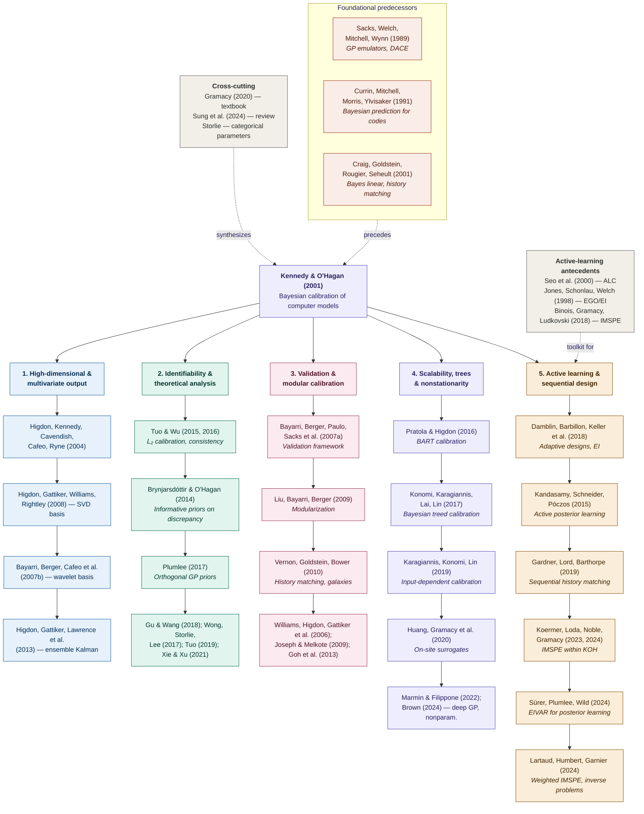

Computer model calibration involves using both physical and simulation observations to learn unknown parameters of an expensive simulator while accounting for model discrepancy. This field has grown into a substantial sub-field of statistics and uncertainty quantification over the past two and a half decades. To get a better grasp of the field, I organized the major contributors (to the best of my knowledge) into a hierarchical tree, showing how the field branched out from a single foundational paper and where active learning fits into the picture.

## The lineage at a glance

## The Root: Kennedy and O'Hagan (2001)

Essentially all modern work in this area traces back to Marc Kennedy and Anthony O'Hagan's 2001 paper *[Bayesian Calibration of Computer Models](https://watermark02.silverchair.com/jrsssb_63_3_425.pdf?token=AQECAHi208BE49Ooan9kkhW_Ercy7Dm3ZL_9Cf3qfKAc485ysgAAA4EwggN9BgkqhkiG9w0BBwagggNuMIIDagIBADCCA2MGCSqGSIb3DQEHATAeBglghkgBZQMEAS4wEQQMwwaZD7paLDJ6IyErAgEQgIIDNJtztF61FcoGiheB2Mbp8rq6hNL3iuTDA-R2ArolTy9SGtst1rB9SrFDfoSAJdN4wMNLFbWIFPvwdoPOhy0FD-k3rhKgIZSnae4pm-_WUssvjxay2AW9bSxdzwhIV_OOxzC1m9hXcy1Nu7Mqt-y-1RQm9q-qiLRIKfNqlfAxcFzFlWCFFk_B0OrFwICf1AtPjsOrm7B1g-UdnoHFq6cTxk7YkiU6uu3Ue2aJHrPY8JfXeLjbI0WP1Y9LXwaHdUeZCoAt14QXLPWA9Z6XS1MVwfjYwnX3mJvJSNv5iuTJzv0v9JTSpFzmMwfGB_Id1hGsocov1LkolpetS0mrDpZMGZGrFiuZbxslPuB7tBgA3ggekCtN5fwpWk0mjPIfmnqO9GpeuLvm8gOqsdi-x6EX81K4oywQ3QlUb0cUJtkX7y8PtomroM4uJl97Ct7r5slcs0bSj3r_a1MiAV6hE5LAqqB9bNT1p7TL4c6fLD8PjRt0eNq8sj0PniEY9-Hei7J_vB-XBaflq2AZ3nmRHN5wr9U1tw6ANxlkvMbUVE1RsnNlpg2U9lDJqsk37LcEgpl8jY6cRxYoIEdkpPyrIFwTdw_03J0iioks1C7PpXWROq3KXO-OkrAapuRX_QodpRn975f05XJQUfpcbiE6nrd36uvTK2CyvZ71Kqz36wjbqqaYJqqzAD_cYOb_YVj4UZ19nIEvg-V3dFeopGnW7VEeFg-iUlrVrYVb5ZXVm3FNrrHuxizfSfL98jpZxHBWJTGahi-m0NjzxPMDOENiP1McgtS33ny8wqntBMW8k7EKBvWvS2vmoHK15MPXFahy9Tpl5by0fkZmNOGMtxE1mQlTjv_LMQQ-vIF9Jb8FM97rBdGBlwE07DFEK40AJxvkLmru6Z2MzNM0vhyl17o8pJ0cPY0F2oGe3lHlSeZd8fG47U1pVn3pWj7P4eMPv-ItKmstqb6uUr3_-9yfTF0bCT8xyyOdBWX7-YOMlnPGuBndrQ6ZIqx_ArTUjXExrpehTC4-XRTGd77pA7ntN5dnQyv1DJZUUyvMmmaGOEUyPfdVbLpZ3zvz68O2PwYhnIbhx-RI9FoFKac)* published in  *JRSSB*. They introduced the coupled Gaussian-process formulation: one GP as an emulator of the expensive simulator, a second GP for the model-discrepancy (or "bias") term, along with a Bayesian inferential machinery for jointly learning the calibration parameters and the discrepancy. Their earlier [2000 *Biometrika* paper on multi-fidelity codes](https://www.jstor.org/stable/2673557?seq=3) is a direct predecessor.

That paper sits on top of the broader computer-experiments tradition that preceded it:

- **Sacks, Welch, Mitchell, Wynn (1989)** — Gaussian-process emulation and the design/analysis of computer experiments.
- **Currin, Mitchell, Morris, Ylvisaker (1991)** — Bayesian prediction for deterministic computer codes.
- **Craig, Goldstein, Rougier, Seheult (2001)** — the parallel Bayes-linear / history-matching lineage.

## The Five Major Branches

After 2001, the field grew along roughly five threads. The same author can appear in multiple branches; the placement below reflects what I think is the headline contribution.

### 1. High-dimensional and multivariate output

This branch tackles how to calibrate when the simulator returns functional, spatial, image-like, or otherwise high-dimensional output. The dominant figures are Dave Higdon and collaborators at Los Alamos, plus the Bayarri–Berger SAMSI group.

- **Higdon, Kennedy, Cavendish, Cafeo, Ryne (2004)** — combining field data and computer simulations (SIAM J. Sci. Comput.); the canonical first follow-up to KOH with a worked engineering example.
- **Higdon, Gattiker, Williams, Rightley (2008)** — *Computer Model Calibration Using High-Dimensional Output* (JASA); SVD basis representations.
- **Bayarri, Berger, Cafeo, Garcia-Donato, Liu, Palomo, Parthasarathy, Paulo, Sacks, Walsh (2007b)** — *Computer Model Validation with Functional Output* (Annals of Statistics); wavelet basis approach.
- **Higdon, Gattiker, Lawrence, Jackson, Tobis, Pratola, Habib, Heitmann, Price (2013)** — ensemble-Kalman-based calibration.

### 2. Identifiability and theoretical analysis

A long-standing concern with KOH is that the calibration parameters and the discrepancy function are jointly non-identifiable. This branch establishes the asymptotic theory and proposes corrective estimators.

- **Tuo and Wu (2015, 2016)** — proved that a simplified KOH estimator is L₂-inconsistent and defined the calibration parameter as the L₂ projection.
- **Brynjarsdóttir and O'Hagan (2014)** — articulated the role of informative priors on the discrepancy in resolving identifiability in practice.
- **Plumlee (2017)** — orthogonal Gaussian-process priors that impose an orthogonality constraint on the bias function.
- **Gu and Wang (2018)** — scaled Gaussian processes that constrain the "size" of the bias function.
- **Wong, Storlie, Lee (2017)** — frequentist theory for KOH-type estimators.
- **Tuo (2019)** — projected kernel calibration with semiparametric efficiency.
- **Xie and Xu (2021)** — treats the calibration parameter as a functional of the bias function via a projected Bayesian approach.

### 3. Validation and modular calibration

This branch grew out of the SAMSI computer-models program. It is especially influential among practitioners who want to decouple emulator fitting from calibration inference.

- **Bayarri, Berger, Paulo, Sacks, Cafeo, Cavendish, Lin, Tu (2007a)** — *A Framework for Validation of Computer Models* (Technometrics).
- **Liu, Bayarri, Berger (2009)** — modularization of the KOH framework, where the emulator is fit first and held fixed during calibration.
- **Vernon, Goldstein, Bower (2010)** — history matching applied to galaxy formation; a leading non-KOH alternative.
- **Williams, Higdon, Gattiker, Moore, McKay, Keller-McNulty (2006)** — combining simulations with field data for engineering systems.
- **Joseph and Melkote (2009); Goh, Bingham, Holloway, Grosskopf, Kuranz, Rutter (2013)** — engineering-oriented adjustments and calibration with multiple simulators.

### 4. Scalability, trees, and nonstationarity

This branch attacks the cost of calibration when emulators must be large, nonstationary, or otherwise hard to fit with a single global GP.

- **Pratola and Higdon (2016)** — BART (Bayesian Additive Regression Trees) calibration.
- **Konomi, Karagiannis, Lai, Lin (2017)** — Bayesian treed calibration applied to carbon capture (JASA).
- **Karagiannis, Konomi, Lin (2019)** — input-dependent Bayesian model calibration.
- **Huang, Gramacy, Binois, Libraschi (2020)** — on-site surrogates (OSS) that make fully Bayesian calibration feasible at scale.
- **Marmin and Filippone (2022)** — deep GPs for both the emulator and the discrepancy.
- **Brown (2024)** — nonparametric functional calibration.

### 5. Active learning and sequential design

This is the most recently active branch and the one most directly relevant to anyone deciding which simulator run to perform next. The general active-learning machinery (Seo et al. (2000) ALC, Jones, Schonlau, Welch (1998) EGO/EI, Binois, Gramacy, Ludkovski (2018) IMSPE) is the toolkit that this branch adapts to the calibration setting.

- **Damblin, Barbillon, Keller, Pasanisi, Parent (2018)** — adaptive numerical designs for code calibration using an expected-improvement-style criterion (SIAM/ASA JUQ).
- **Kandasamy, Schneider, Póczos (2015)** — Bayesian active learning of the posterior via GP emulation of the log-likelihood.
- **Gardner, Lord, Barthorpe (2019)** — sequential Bayesian history matching for model calibration.
- **Koermer, Loda, Noble, Gramacy (2023, 2024)** — IMSPE criteria specifically within the Kennedy–O'Hagan calibration framework; the paper *Augmenting a Simulation Campaign for Hybrid Computer Model and Field Data Experiments* (arXiv:2301.10228) is the headline reference.
- **Sürer, Plumlee, Wild (2024)** — expected integrated variance (EIVAR) criterion for accurately learning the posterior density of parameters with multivariate output.
- **Lartaud, Humbert, Garnier (2024)** — weighted IMSPE criterion for Bayesian inverse problems.

## Cross-cutting and applied contributors

A handful of authors are best understood as cross-cutting rather than belonging to one branch:

- **Robert Gramacy** — his 2020 textbook *Surrogates: Gaussian Process Modeling, Design, and Optimization for the Applied Sciences* is the standard modern reference, and he is co-author on much of the recent active-learning-for-calibration work.
- **Chih-Li Sung** — first author on the 2024 WIREs Computational Statistics review of the KOH framework, which is the most current synthesis.
- **Curtis Storlie** — calibration with categorical parameters.

Application-driven authors who have shaped methodology through their use cases include Han, Santner, Rawlinson (biomechanics); Murphy et al. (climate prediction); Farah, Birrell, Conti, De Angelis, Presanis, Lopes, Sung & Hung (epidemiology); Wang, Chen, Tsui (manufacturing); Allaire, Zhou (aerospace); and Thelen et al. and Kenett & Bortman (digital twins).

<!-- ## Where active learning fits into the picture

Active learning enters the calibration story specifically as a way to choose simulator inputs to evaluate next, when each simulator run is expensive and only a handful can be afforded. The key distinction from general Bayesian optimization is the *target*: in calibration we are not optimizing the simulator output — we are trying to (a) accurately recover the posterior over calibration parameters, (b) make accurate predictions of the physical system under new conditions, or (c) both. This changes the acquisition function. EI-style criteria (Damblin et al.) push toward the posterior mode but can starve the rest of the posterior surface. IMSPE-style criteria (Koermer et al., Sürer et al., Lartaud et al.) target predictive accuracy across the input space and tend to be the more principled choice when the downstream goal is prediction or posterior inference rather than point estimation. -->

## A single recent survey to anchor further reading

If you want one paper that ties most of the above together, Sung et al. (2024), [*A Review on Computer Model Calibration*](https://wires.onlinelibrary.wiley.com/doi/pdf/10.1002%2Fwics.1645), WIREs Computational Statistics, is the most current synthesis and was a useful spine for this tree.

## References (selected)

- Kennedy, M. C., & O'Hagan, A. (2001). Bayesian calibration of computer models. *JRSSB*, 63(3), 425–464.
- Higdon, D., Kennedy, M., Cavendish, J. C., Cafeo, J. A., & Ryne, R. D. (2004). Combining field data and computer simulations for calibration and prediction. *SIAM J. Sci. Comput.*, 26, 448–466.
- Higdon, D., Gattiker, J., Williams, B., & Rightley, M. (2008). Computer model calibration using high-dimensional output. *JASA*, 103, 570–583.
- Bayarri, M. J., et al. (2007a). A framework for validation of computer models. *Technometrics*, 49, 138–.
- Bayarri, M. J., et al. (2007b). Computer model validation with functional output. *Annals of Statistics*, 35(5), 1874–1906.
- Tuo, R., & Wu, C. F. J. (2015). Efficient calibration for imperfect computer models. *Annals of Statistics*, 43(6), 2331–2352.
- Plumlee, M. (2017). Bayesian calibration of inexact computer models. *JASA*, 112(519), 1274–1285.
- Brynjarsdóttir, J., & O'Hagan, A. (2014). Learning about physical parameters: the importance of model discrepancy. *Inverse Problems*, 30(11), 114007.
- Damblin, G., Barbillon, P., Keller, M., Pasanisi, A., & Parent, E. (2018). Adaptive numerical designs for the calibration of computer codes. *SIAM/ASA JUQ*, 6(1), 151–179.
- Koermer, S., Loda, J., Noble, A., & Gramacy, R. B. (2024). Augmenting a simulation campaign for hybrid computer model and field data experiments. arXiv:2301.10228.
- Sürer, Ö., Plumlee, M., & Wild, S. M. (2024). Sequential Bayesian experimental design for calibration of expensive simulation models. *Technometrics*.
- Sung, C.-L., et al. (2024). A review on computer model calibration. *WIREs Computational Statistics*, e1645.
- Gramacy, R. B. (2020). *Surrogates: Gaussian Process Modeling, Design, and Optimization for the Applied Sciences*. Chapman & Hall/CRC.
